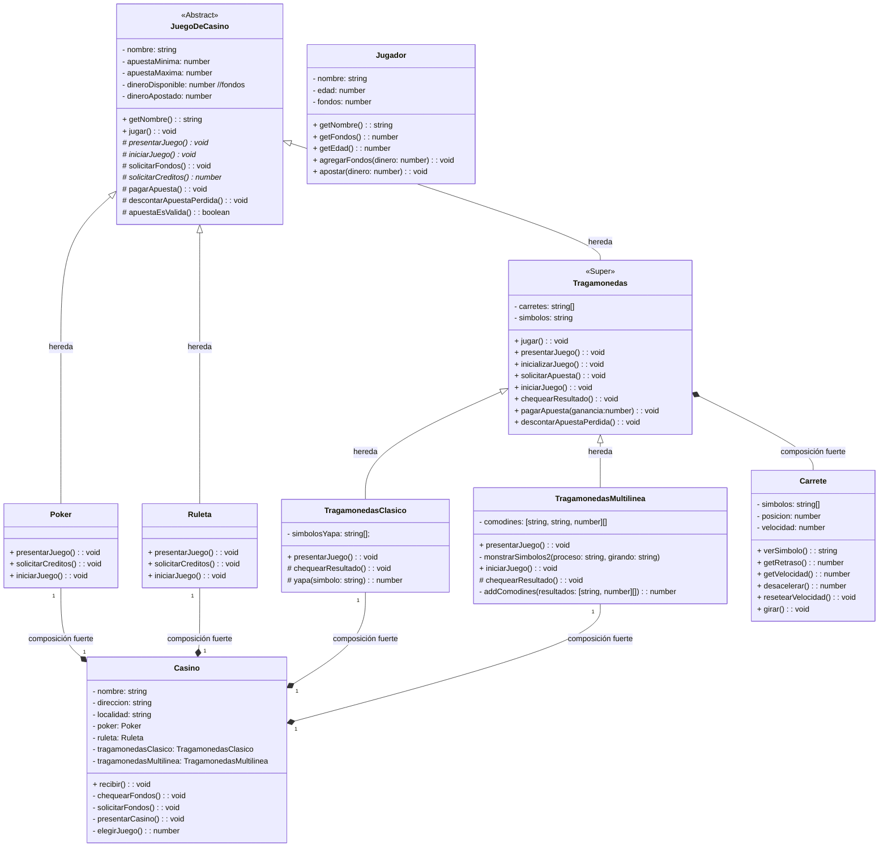

# POO-Final-2do-Cuatrimestre

### Grupo de Trabajo:
- Alvarez Torriglia Facundo
- Escobar Mariano
- Patronelli Mario
- Reyes Javier

### paquetes utilizados:
en Node.js :
```shell
npm i [readline-sync]
npm i [@types/node]
npm i [ascii-text-generator]
```
<!-- 
npm i beepbeep
npm i ts-node // para no crear *.JS
-->
- [readline-sync](https://www.npmjs.com/package/readline-sync)
- [@types/node](https://www.npmjs.com/package/@types/node)
- [ascii-text-generator](https://www.npmjs.com/package/ascii-text-generator)

### Como ejecutarlo ?
en Node.js:
para ejecutar el programa, primero instalar las dependencias, despues ejecutar:
```shell
git clone https://github.com/elMarito/POO-Casino.git
cd POO-CASINO
npm install
node dist/index.js

```

### UML:
#### Diagrama de Clases:




<!--PARA EDITAR MARKDOWN FILES:  https://stackedit.io/app# -->
