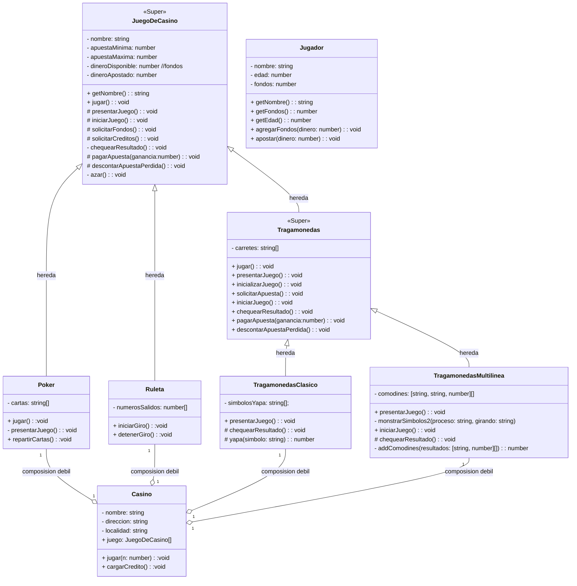

# POO-Final-2do-Cuatrimestre

### paquetes utilizados:
[ascii-text-generator](https://www.npmjs.com/package/ascii-text-generator)

en Node.js :
```shell
npm i readline-sync
npm i @types/node
npm i ascii-text-generator
npm i beepbeep

npm i ts-node // para no crear *.JS

```


### Grupo de Trabajo:
- Alvarez Torriglia Facundo
- Escobar Mariano
- Patronelli Mario
- Reyes Javier


### UML:
#### Diagrama de Clases:


#### Como ejecutarlo ?
en Node.js:

para ejecutar el programa, primero instalar las dependencias, despues ejecutar:
```shell
git clone https://github.com/elMarito/POO-Casino.git
cd POO-CASINO
npm install
node dist/index.js

```